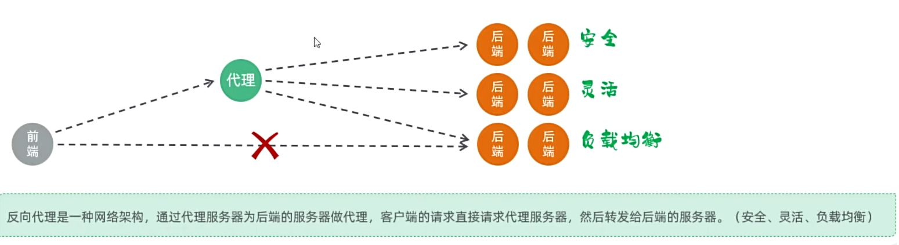

## Nginx反向代理



客户端如果直接访问后端服务器，则会导致服务器的端口号泄露，并且在服务器集群时会导致负载不均衡以及无法处理服务器选择的情况。
所以，通过**反向代理网络框架**可以让前端向代理服务器发送请求，代理服务器再去决定使用哪个后端服务器进行响应，实现安全，灵活，负载均衡等好处。

> 正向代理是代理客户端，让明确的服务端通过代理访问客户端
> 反向代理则是代理服务端，让明确的客户端通过代理访问服务端 --> 在如今数据量大，高并发多的环境中，反向代理是主流

### 反向代理配置示意
```conf
    server {
            listen       90;        // 前端端口号
            server_name  localhost; // 服务器名

            ; 省略

            location ^~ /api/ {     ; 定义匹配路径的方式，这里是匹配 /api/ 开头的路径
                rewrite ^/api/(.*)$ /$1 break;      // 路径重写，比如 /api/depts
                proxy_pass http://localhost:8080;   // 代理转发，反向代理的后端服务器
            }
}
```